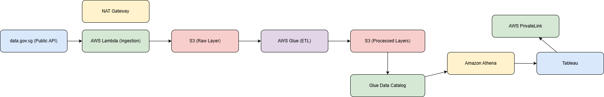
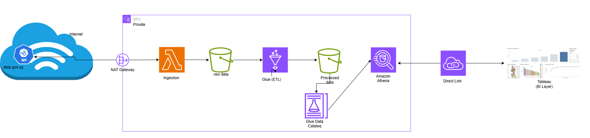

# 🏠 HDB Resale Data Engineering Pipeline

## 📌 Overview

This project implements an end-to-end ETL pipeline for processing HDB resale flat data (2012–2016), focusing on data quality, transformation, and reproducibility.

---

## 🎯 Objectives

* Build a programmatic ETL pipeline (no manual intervention)
* Perform data profiling and validation
* Handle duplicates using business rules
* Generate a Resale Identifier
* Detect anomalies using statistical heuristics
* Produce structured output datasets

---

## 🏗️ Architecture (Logical Flow)

RAW → VALIDATED → CLEANED → TRANSFORMED → HASHED → FAILED


### Logical Design

<p align="center">
  
</p>


### High Level Architecture

```
data.gov.sg (Public API)
        ↓
AWS Lambda (or AWS Batch)
        ↓
Amazon S3 (Raw Layer)
        ↓
AWS Glue (ETL Jobs)
        ↓
Amazon S3 (Processed Layers)
```

<p align="center">
  
</p>


## ⚙️ Tech Stack

* Python (Pandas, NumPy)
* Great Expectations (Data Quality Framework)
* Parquet (Efficient Storage Format)

---

## 📊 Data Quality Framework

I have used **Great Expectations** to:

* Define declarative validation rules
* Generate Data Docs (validation reports)
* Enable pipeline observability

---

## 🔑 Key Features

### 1. Data Validation

* Regex-based date validation
* Domain-based categorical validation
* Statistical range validation

### 2. Deduplication Strategy

* Composite key: all columns except resale_price
* Retain highest price for duplicates
* Lower price records moved to failed dataset

### 3. Remaining Lease Calculation

* Based on 99-year lease assumption
* Computed dynamically relative to current date

### 4. Resale Identifier

Format:
S + BlockDigits + PricePrefix + Month + TownInitial

### 5. Hashing

* SHA256 used for irreversible hashing
* Ensures uniqueness and security

### 6. Anomaly Detection

* IQR-based statistical method
* Detects extreme resale prices

---

## 📂 Output Datasets

| Layer       | Description                           |
| ----------- | ------------------------------------- |
| Raw         | Original dataset                      |
| Cleaned     | Validated and deduplicated            |
| Transformed | Business transformations applied      |
| Failed      | Invalid or duplicate records          |
| Hashed      | Final dataset with hashed identifiers |

---

## 🚀 How to Run

```bash
pip install -r requirements.txt
python src/pipeline.py
```

---

## 📓 Notebook

Refer to:
`notebooks/hdb_pipeline.ipynb`

Includes:

* Step-by-step pipeline execution
* Data profiling
* Validation results
* Data Docs integration

---

## 🧠 Design Principles

* Modularity
* Reproducibility
* Data Quality First
* Scalability (future Spark/AWS migration)

---

## 🔮 Future Enhancements

* PySpark implementation for large-scale processing
* Airflow orchestration
* AWS deployment (S3 + Glue + Athena)
* Data lineage tracking

---

## 👤 Author

Parag – Senior Data Engineer Candidate
